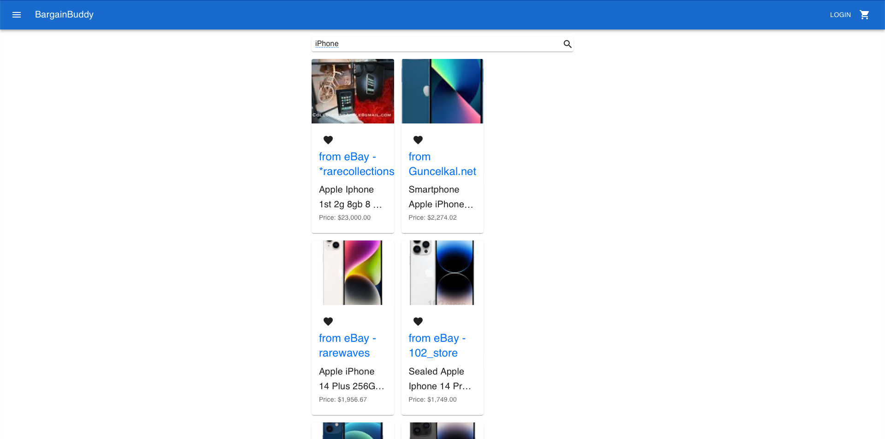

# README Generator

## Description 

BargainBuddy is a price comparison marketplace that allows users to compare prices of products from various online retailers to make sure they are always getting the best deal, no matter what they’re buying.

This has been built using:

Languages:						
    HTML
    CSS
    Javascript

API’s:						
    Pricer.p (Rapid API)

NPM Modules:						
    React
    Node.js
    Axios
    React Router
    Material UI
    MailChimp

Homepage

## Table of Contents
- [Description](#Description)
- [Installation](#Installation)
- [Usage](#Usage)
- [License](#License)
- [Contributing](#Contributing)
- [Tests](#Tests)
- [Questions](#Questions)

## Installation 
npm i

## Usage 
node index.js

## License 

## Contributing 
N/A

## Tests 
N/A
